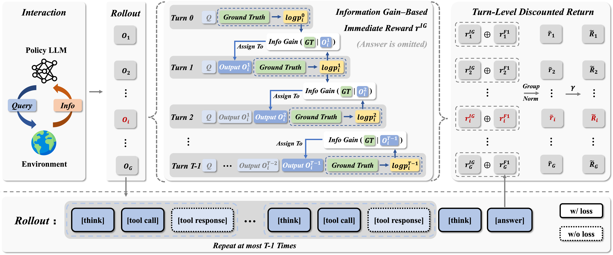
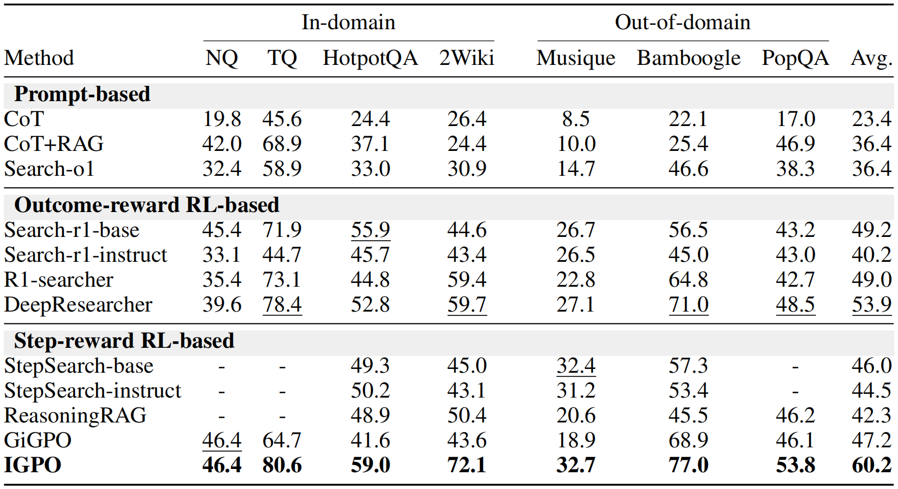

<h1 align="center">✨ Information Gain-based Policy Optimization: A Simple and Effective Approach for Multi-Turn Search Agents

</h1>

<h5 align="center"> If you like our project, please give us a star ⭐ on GitHub for the latest update.</h5>

<div align="center"> 

[](https://arxiv.org/abs/2510.14967)
[](https://huggingface.co/papers/2510.14967)
[](https://www.python.org/downloads/release/python-390/) 
</div>

## 📣 Latest News
- **[Jan 26, 2026]**: 🎉 Our **[IGPO](https://arxiv.org/abs/2507.19849)** paper has been accepted at ICLR 2026!
- **[Oct 17, 2025]**: 📄 Our IGPO paper is now available on **[arXiv](https://arxiv.org/abs/2510.14967)** and **[Hugging Face](https://huggingface.co/papers/2510.14967)** daily paper.

## 💡 Method Overview
We introduce IGPO, an RL algorithm for fine-grained credit assignment in search agent training. By modeling agentic search turns as an incremental information acquisition process, IGPO defines rewards as the marginal gain in the policy's probability of generating the correct answer. 

<p align="center">
    
</p>

## 📊 Overall Performance
<p align="center">
    
</p>

## 🚀 Quick Start

## 📄 Citation
```bibtex
@article{wang2025information,
  title={Information Gain-based Policy Optimization: A Simple and Effective Approach for Multi-Turn LLM Agents},
  author={Wang, Guoqing and Dai, Sunhao and Ye, Guangze and Gan, Zeyu and Yao, Wei and Deng, Yong and Wu, Xiaofeng and Ying, Zhenzhe},
  journal={arXiv preprint arXiv:2510.14967},
  year={2025}
}
```

## 🙏 Acknowledgement 

IGPO is inspired by [Deepseek-R1](https://github.com/deepseek-ai/DeepSeek-R1), with its implementation built upon [veRL](https://github.com/volcengine/verl), [Search-r1](https://github.com/PeterGriffinJin/Search-R1), and [DeepResearcher](https://github.com/GAIR-NLP/DeepResearcher). We are grateful to the teams behind these projects for their significant contributions to open-source research and development.

## 📄 License

This project is released under the [MIT License](LICENSE).

## 🌟 Star History

<a href="https://star-history.com/#YOUR_USERNAME/IGPO&Date">
 <picture>
   <source media="(prefers-color-scheme: dark)" srcset="https://api.star-history.com/svg?repos=YOUR_USERNAME/IGPO&type=Date&theme=dark" />
   <source media="(prefers-color-scheme: light)" srcset="https://api.star-history.com/svg?repos=YOUR_USERNAME/IGPO&type=Date" />
   
 </picture>
</a>
